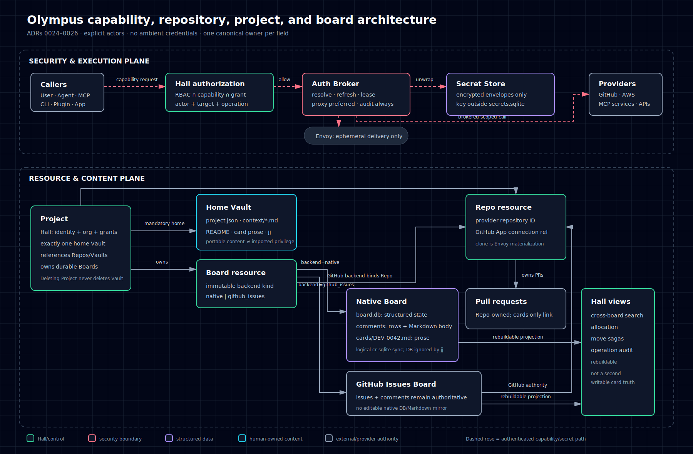
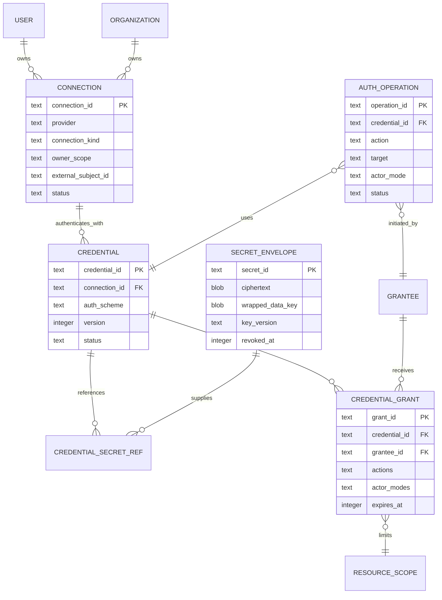

# ADR 0024 — Secret Store, External Connections, and the Auth Broker

- Status: Accepted
- Date: 2026-07-17
- Amends: ADR 0010 (`auth.sqlite` is identity/authorization metadata, not the store for external secret payloads)
- Relates to: ADR 0005 (organization boundary), ADR 0011 (agent capabilities), ADR 0015 (managed apps and plugins), ADR 0018 (producer-side redaction)

## 1. Context

Olympus-managed CLIs, MCP servers, workflows, agents, plugins, and apps need to authenticate to external systems. Credentials may belong to an organization, an individual user, or Olympus automation. They may be API keys, OAuth grants, application private keys, SSH keys, certificates, or renewable cloud credentials.

Passing ambient host credentials into every process would make attribution accidental, let one plugin read unrelated credentials, leak secrets into session files and logs, and make revocation unreliable. A generic `secret.read` permission would expose durable credential material when most consumers need only permission to perform one provider action.

ADR 0010 already makes `~/.olympus/auth.sqlite` the transactional security store for Hall identities, memberships, roles, and login sessions. This ADR preserves that role and separates external secret payloads from identity and authorization metadata.

### Current implementation, verified

`AuthStore` is one mutex-protected SQLite connection and currently initializes only users, organizations, memberships, and login sessions (`crates/control-plane/src/auth_store.rs:46-105`). Hall opens it at `~/.olympus/auth.sqlite` (`crates/control-plane/src/main.rs:97`). There is no external connection, credential, encrypted secret, grant, lease, or broker schema/path in the reviewed source. ADR 0018 already forbids retaining secrets in diagnostics; this ADR supplies the missing runtime credential boundary rather than extending ambient configuration.

## 2. Decision

Olympus adopts four distinct concepts:

1. **Secret Store** stores encrypted opaque secret envelopes.
2. **Connection and Credential** describe an external identity, installation, authentication method, and lifecycle without embedding secret bytes.
3. **Credential Grant** authorizes a grantee to use a credential for named provider capabilities and resources.
4. **Auth Broker** is the only runtime path from an authorized operation to secret material or a derived short-lived credential.

**Doctrine:** Olympus-managed tools receive authorized capabilities, not ambient credentials. Raw durable secrets remain behind the Auth Broker; actor identity, scope, delivery, refresh, revocation, and audit are explicit and fail closed.

`AuthStore` remains the implementation name for Hall login and RBAC state. `SecretStore` is the canonical product term for encrypted external secret payloads. The terms are not interchangeable.



## 3. Authority and data model



| Concern | Authority | Explicitly not authority |
|---|---|---|
| Hall users, memberships, roles, login sessions | `auth.sqlite` under ADR 0010 | event/search projections |
| Connection metadata, credential metadata, grants, revocation, operation audit | transactional Hall security store | plugin manifests, session config, vault files |
| Encrypted secret payloads | Secret Store | business event log, search, telemetry, backups that lack secret-specific encryption policy |
| Provider truth and provider-side grants | external provider | cached capability snapshots |
| Runtime process presence and injection | Envoy observation | permission to use a credential |

Connections are owned by exactly one `System`, `Organization(org_id)`, or `User(user_id)` scope. Projects and Repos do not own credentials and are never executable grantees. They may constrain a policy template's target scope, but every usable grant terminates at a concrete human or runtime principal: user, agent/session, workflow, MCP server instance, plugin installation, or app service. Any inherited Project/Repo policy is explicitly materialized/delegated to that principal and current Project membership/Repo binding remains part of authorization; there is no “any process in this Project” grant.

A connection models the stable external relationship, such as a GitHub App installation or a user's OAuth authorization. A credential models one authentication method and may rotate without changing the connection identity. Credentials reference secret envelopes by opaque IDs.

## 4. Secret Store

Secret payloads are stored separately from `auth.sqlite`, initially under `~/.olympus/secrets.sqlite`, using envelope encryption:

- each payload has a random data-encryption key;
- the payload is authenticated-encrypted;
- the data key is wrapped by a versioned installation master key;
- associated data binds ciphertext to Hall identity, owner scope, secret ID, kind, and key version;
- secret rows never contain project permissions or provider-selection policy.

The wrapping key must come from an OS keyring, TPM, hardware-backed KMS, or explicitly provisioned operator master key. It must not be stored in plaintext beside `secrets.sqlite`. Without a configured wrapping-key provider, creation and use of persistent external credentials fail closed.

Hall persists non-secret key metadata: `key_provider_id`, provider-specific immutable key locator, cryptographic suite/version, `key_version`, lifecycle state (`active`, `decrypt_only`, `retired`, `destroyed`), Hall/installation identity binding, and creation/activation timestamps. First boot requires an authenticated, audited key bootstrap. On every later boot, existing ciphertext forbids implicit key generation: a missing/wrong provider, locator, Hall identity, or key fails closed and leaves the Secret Store sealed.

Master-key rotation is a resumable state machine:

```text
prepared -> active_for_new_writes -> rewrapping -> verified
         -> old_key_decrypt_only -> old_key_retired -> destroyed
```

The new key and metadata become durable before new envelopes use it. Rewrap is idempotent and compare-and-swap versioned. The old key remains `decrypt_only` until every live envelope and retained backup generation is verified under the new recovery set. Retirement and destruction are distinct audited transitions and cannot occur while a required backup still depends on the key.

Backup-key recovery must work independently of the source host through a configured KMS locator, sealed offline recovery key, or explicit authenticated operator import. The recovery manifest carries Hall/installation identity and AAD version. Replacement-Hall restore either proves that identity or performs an audited identity-rebind rewrap while the store remains sealed; it never weakens or skips AAD validation.

Secret Store operations are narrowly typed: create, unwrap for a broker operation, compare-and-swap rotate, revoke, and rewrap. Plaintext is held only in bounded memory, is never returned by listing APIs, and is excluded before telemetry serialization. Backup and restore use a separate encrypted secret-backup policy and require a restore drill; ordinary Hall or vault backups do not silently include usable credentials.

## 5. Credential grants and authorization

A `CredentialGrant` names:

- one credential or explicitly governed credential set;
- a concrete grantee identity: user, agent, session, workflow, MCP server definition, plugin installation, or app installation;
- provider-specific actions such as `github.issue.write` or `aws.s3.read`;
- resource constraints such as repository, account, bucket, or provider tenant;
- allowed actor modes;
- allowed delivery modes;
- expiry and revocation state.

Authorization is the intersection of all applicable boundaries:

```text
authenticated principal and current org membership
∩ human RBAC
∩ agent/session capability envelope
∩ plugin/app installation grant
∩ credential grant
∩ provider-side access and permissions
∩ target resource policy
```

A missing, stale, or ambiguous boundary denies the operation. Credential grants are additive to, never substitutes for, ADR 0010 human RBAC and ADR 0011 agent capabilities. The operator installation token remains break-glass authority but does not cause secret bytes to be returned through ordinary APIs.

## 6. Actor mode is explicit

Every operation declares one actor mode:

- `user`: requires an initiating user, a valid user-owned connection, and explicit delegation to the calling runtime;
- `organization`: uses an organization-owned service identity under organization policy;
- `application`: uses an application installation identity for reconciliation, webhooks, scheduled automation, or other system work.

There is no ambient fallback between actor modes. A user-originated retry cannot silently become an application-originated action. If its user credential is unavailable or revoked, the operation pauses and requests reconnection.

Equivalent service credentials may be pooled only under an explicit selection policy. Credentials representing different users, tenants, scopes, or actor modes are never transparently interchangeable.

## 7. Auth Broker protocol

A runtime asks the Auth Broker for a capability, not a secret:

```text
Request(principal, org, grantee, provider, action, target, actor_mode, runtime)
   -> authorize all planes
   -> select exact connection/credential
   -> create durable AuthOperation
   -> refresh or mint under a per-credential lock
   -> issue provider-scoped lease or proxy provider request
   -> record result and revoke lease
```

Authorization has one serialized linearization point in Hall's transactional security store. In that transaction Hall reads current membership/RBAC, capability, installation, grant, credential, and revocation epochs and inserts the `AuthOperation` plus lease intent. The operation records the exact revisions/epochs used, initiating principal, distinct runtime grantee, credential ID, action, target, actor mode, request digest, idempotency key, status, provider result reference, and timestamps. It never records secret values or authorization headers.

After any external mint and before IPC handoff, the broker enters the same serialized security-store boundary used by revocation and compare-and-swap transitions the exact lease intent from `pending` to `delivery_authorized` only if every recorded epoch still matches current truth. This final CAS—not the earlier authorization read—is the credential-release linearization point. A mismatch denies delivery, destroys/unreferences the minted material, and moves the operation to reconciliation.

Revocation increments the relevant epoch and atomically fences every non-terminal intent. Before revocation returns, Envoy has acknowledged termination/revocation of each already-authorized raw lease's complete descendant cgroup and closed its broker-owned handoff channel/FD; provider revocation is requested where supported. A handoff and revocation therefore serialize through lease state plus Envoy acknowledgement rather than a check-then-deliver race. Crash/race tests cover revocation before the final check, between provider mint and final CAS, between CAS and IPC handoff, during handoff, after child receipt, and while Envoy is unavailable; failure to obtain termination acknowledgement remains fail-closed and visibly degraded.

OAuth refresh uses a transactional per-credential lease and compare-and-swap credential version. This is required for providers that rotate and invalidate refresh tokens. Concurrent Hall/Envoy processes may not independently refresh the same credential. Terminal revocation marks the credential unavailable until explicit reauthorization.

## 8. Runtime delivery

The broker prefers not to disclose a token at all. Delivery modes, in descending preference, are:

1. **Brokered provider request:** the plugin/tool submits a typed operation; the broker performs it.
2. **Authenticated local broker socket:** a long-lived runtime receives narrow short-lived leases after authenticating its process identity.
3. **Inherited file descriptor or read-only temporary file:** for clients requiring file credentials.
4. **Child-process environment:** for CLIs that support a token environment variable.
5. **Ephemeral credential helper or `GIT_ASKPASS`:** for Git transport.

Envoy performs the host effect. Credentials are injected into one child process only and are never written to shared homes, `.env`, shell history, command arguments, repository remotes, session workspaces, or agent context. Temporary files live outside the writable session tree, use mode `0600`, are mounted/read once where possible, and are removed when the lease ends.

The brokered-request surface is a typed provider adapter, not a generic URL/header proxy. Provider host, tenant, target, redirect policy, method, and response redaction derive from the authorized connection and action, preventing SSRF and confused-deputy use.

Once disclosed, a bearer token is constrained only by provider scope and lifetime—not by the single Olympus action in its audit record. Action-level enforcement therefore requires brokered typed calls. Raw delivery is an explicit high-risk grant available only to an Envoy-launched allowlisted executable with structured argv, a dedicated runtime principal/OS identity, blocked sibling-process `/proc` access, read-only/ephemeral filesystem boundaries, and target-restricted egress. Envoy kills the complete descendant cgroup at lease expiry/revocation. Raw tokens are never injected into an agent-controlled shell, general plugin process, or managed-app process. Managed apps are typed-broker-only. Where the provider supports narrowing at mint time, the broker records and verifies the returned resources, permissions, and expiry and rejects widening.

Olympus must not run persistent global setup commands such as `gh auth setup-git` against a shared host profile. A CLI such as `gh` is an execution client of the broker, not an authentication authority.

## 9. MCP, plugin, and app permissions

MCP definitions and plugin/app manifests declare required capabilities, never secret values. For example:

```yaml
permissions:
  auth:
    - provider: github
      actions: [issue.read, issue.write]
      actorModes: [application]
```

Installation presents requested permissions to an authorized administrator. Approval creates grants bound to the immutable installation ID, exact trusted package/contribution digest, and runtime principal. A manifest cannot grant itself access. Every changed executable digest requires explicit audited grant carry-forward or reapproval; semver range membership never silently transfers credential access.

Plugins and apps do not call the Secret Store. Distinct principals and grants exist for a managed-app service, its companion plugin, MCP server definition, workflow, session, agent, and user. A managed app remains at arm's length under ADR 0015 and may use only typed broker operations under its own service principal; it is never eligible for raw-token delivery and never inherits its companion plugin's grant. Revocation rejects new operations immediately, fences pending delivery, and terminates raw-delivery cgroups; already disclosed provider tokens remain usable until provider revocation or expiry and are treated accordingly.

## 10. Auditing and redaction

Two linked audit records are retained:

- capability use: requester, grantee, credential ID, provider action, target, actor mode, decision, operation ID, and provider result reference;
- secret unwrap: operation ID, secret ID, purpose, destination runtime identity, and success/failure.

They never include token fragments, full environment snapshots, credential-bearing URLs, private-key material, or provider request bodies known to contain secrets. ADR 0018's producer-side serialization firewall remains mandatory. Logs and tool output are also scanned against active secret fingerprints without storing those fingerprints in ordinary telemetry.

## 11. Failure and recovery rules

- Revocation is security truth and propagates ahead of availability.
- A broker outage prevents new authenticated operations; it does not release stored credentials to callers.
- Provider permission snapshots are hints. A provider denial updates health but is not bypassed.
- Every restored connection, credential, grant, lease, and operation enters `quarantined_restore` and is unusable until current Hall policy and provider authorization/revocation state are reconciled and an authorized operator releases it. A restored snapshot is never automatic evidence that a credential remains authorized.
- Deployments requiring automatic rollback detection retain a monotonic credential/revocation epoch in an independently authoritative KMS/HSM record and reject snapshots behind it. Deployments without that facility remain fail-closed in restore quarantine; they do not claim automatic knowledge of post-backup revocations.
- Importing a project or vault can reference a required provider capability but cannot import a connection, grant, credential, or secret.
- Deleting a plugin/app removes its grants before runtime teardown.
- Secret rotation is versioned and retry-safe; old encrypted versions are destroyed after the provider cutover and recovery window.

## 12. Implementation prerequisites and migration

Before external integrations use this path:

1. define the wrapping-key provider trait and production key provider;
2. add an authenticated, transactional Secret Store with tamper and wrong-key tests;
3. extend Hall's security store with connections, credential metadata, grants, operations, and revocation;
4. add broker authorization parity tests across human, agent, session, plugin, and provider scopes;
5. implement cross-process refresh serialization and crash-recovery tests;
6. implement Envoy delivery adapters and prove secrets do not enter argv, workspace, process telemetry, or logs;
7. add revocation, expiry, backup/restore, and audit-redaction tests;
8. migrate any existing external credentials by explicit operator action, never by scanning arbitrary host files in production.

This is production architecture, not a plaintext interim store. Individual provider adapters may land incrementally only after the common security boundary exists.

## 13. Rejected alternatives

- **One generic `AuthStore` table containing tokens and policy:** conflates identity, encrypted payloads, provider lifecycle, and authorization.
- **Environment variables as the source of truth:** ambient, hard to revoke, easy to leak, and lacks actor attribution.
- **Per-tool credential files:** duplicates secrets and creates inconsistent rotation/revocation.
- **Let plugins read organization secrets:** excessive authority; most plugins need operations, not plaintext.
- **Implicit user-to-org fallback:** changes visible actor and permissions during retries.
- **Put credentials in project vaults:** makes synced content a privilege-escalation and secret-exfiltration channel.
