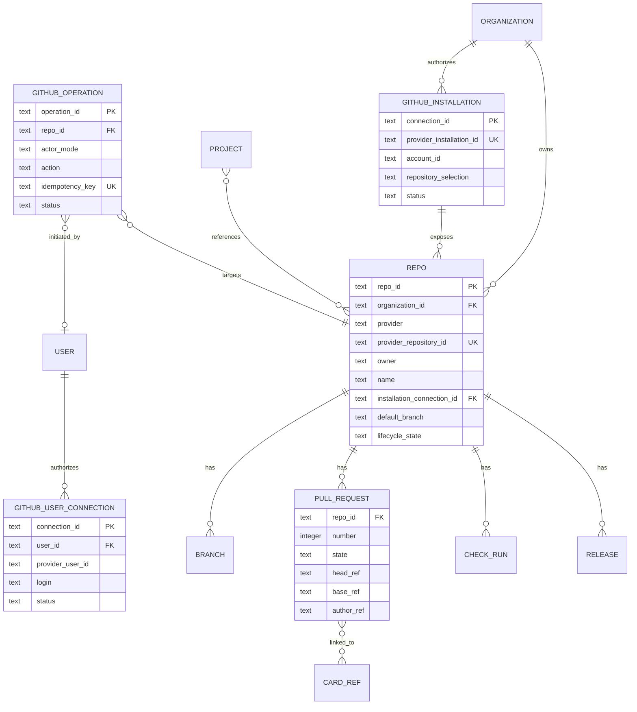

# ADR 0025 — First-Class Repositories and GitHub App Integration

- Status: Accepted
- Date: 2026-07-17
- Amends: ADR 0005 (Repo becomes a durable provider-bound resource rather than only a materialized workspace reference)
- Depends on: ADR 0010 (Hall identity/RBAC), ADR 0024 (connections, credentials, grants, Auth Broker)
- Relates to: ADR 0011 (agent capabilities), ADR 0019 (human and agent CLI), ADR 0026 (GitHub Issues board backend)

## 1. Context

Olympus needs repositories as more than filesystem paths. Projects reference repositories, agents create branches and commits, and users create and review pull requests through Olympus. GitHub Issues may provide the authoritative backend for a project board, while pull requests, reviews, checks, branches, commits, and releases belong to the repository domain.

The `gh` CLI is useful as an execution client but cannot be the integration boundary. Host-level `gh` state cannot provide organization installation scoping, webhooks, user-versus-automation attribution, centralized revocation, or safe credential delivery to many runtimes.

GitHub provides two relevant GitHub App identities:

- installation access tokens perform server-to-server actions attributed to the App and currently expire after one hour;
- GitHub App user access tokens perform user-to-server actions on behalf of a user, are limited to the intersection of user and App installation access, and currently expire after eight hours by default with renewable refresh credentials.

### Current implementation, verified

Olympus already has an early Repo registry, but not the provider/account model decided here. `RepoRow` contains only slug, URL, default branch, and registration time (`crates/control-plane/src/views/repo.rs:15-28`); registration accepts those three caller-supplied strings (`crates/control-plane/src/server/routes/repos.rs:38-55`). `RepoStore` performs clone/fetch/workspace host effects and explicitly says it is not wired to handlers (`crates/control-plane/src/repos.rs:1-18`). There is no immutable provider repository ID, GitHub App installation/user connection, webhook ingestion, PR/check projection, or brokered credential path. This ADR evolves that existing resource rather than introducing a second Repo concept.

## 2. Decision

Olympus will operate a dedicated GitHub App. `Repo` is a durable, organization-owned Hall resource. The App installation binds GitHub repositories to Repo resources; a separate user connection allows an Olympus user to authorize user-attributed operations through that same App.

**Doctrine:** repositories own source-control and pull-request truth; projects reference repositories; boards may use repository issues as a backend; the Auth Broker chooses an explicit user or App actor for every GitHub write.

`gh` and `git` remain replaceable execution clients. They receive ephemeral credentials from ADR 0024 and never own Olympus authentication state.

## 3. Domain model



A Repo's immutable provider identity is the GitHub repository ID, not `owner/name`; repositories may be transferred or renamed. `owner/name` is current display/routing metadata. A local clone or jj workspace is a materialization observed by Envoy and does not create Repo authority.

A Repo stores only connection references. GitHub App private keys, installation token derivation, user refresh tokens, and signing keys remain under ADR 0024.

## 4. Ownership boundaries

| Concern | Canonical authority |
|---|---|
| Repo registration, org ownership, lifecycle, connection reference | Hall |
| GitHub repository identity, visibility, provider permissions | GitHub, reconciled into Hall |
| Local clone/workspace presence and health | Envoy |
| Branches, commits, pull requests, reviews, checks, releases | repository/provider; Hall keeps rebuildable projections and operation audit |
| Project-to-repo reference | Hall project record |
| Card-to-PR relation | Hall relation/projection plus provider-derived links |
| GitHub credentials and grants | ADR 0024 security stores and provider |

Deleting a project removes project references, not Repo resources or GitHub repositories. Retiring a Repo disables new operations and materializations but does not delete the provider repository without a separate, explicitly authorized destructive operation.

## 5. Dedicated GitHub App

The GitHub App is installed on explicitly selected accounts and repositories. Its requested permissions are the minimum required by enabled features. Installation changes, suspension, deletion, and repository-selection changes are reconciled into Hall and immediately constrain future operations.

Initial webhook subscriptions cover enabled capabilities from:

- `installation`, `installation_repositories`, and app suspension/deletion;
- `github_app_authorization` for user revocation;
- repository rename, transfer, archive, and deletion;
- `issues` and `issue_comment` for issue-backed boards;
- `pull_request`, reviews, review comments, and requested reviewers;
- check runs/suites and statuses;
- pushes and releases when those projections are enabled.

Webhook admission verifies the HMAC over the bounded raw body using constant-time comparison before parsing. In one transaction Hall inserts a unique receipt keyed by App/hook installation identity plus GitHub delivery ID, body digest, event/action, receive time, and `queued` state. Hall returns 2xx only after that commit. A duplicate key with a different digest is a security error.

Workers lease durable receipts. Local projection mutation and receipt completion commit together; any external mutation uses a durable `GitHubOperation`. Projection application is monotonic per immutable provider resource ID and provider revision when a suitable revision exists. An older/ambiguous payload triggers a current-state refetch rather than overwriting a newer projection. Reconciliation uses resource/event-specific cursors, deliberate overlap windows, and idempotent upsert—not `updated_at` as one universal total-order cursor. Crash tests cover receipt commit, 2xx send, worker lease, projection commit, provider side effect, and completion.

Portable project/vault manifests can refer to a provider repository identity but cannot install the App, import credentials, bind an installation, or grant repository access.

## 6. Explicit GitHub actors

Each GitHub mutation records exactly one actor mode:

### User actor

Use a GitHub App user access token when an authenticated user directly requests an issue, comment, branch push, pull request, review, merge, or similar action and has delegated that action to the runtime. Provider access is the intersection of:

```text
repositories granted to the App installation
∩ repositories accessible to the GitHub user
∩ App permissions
∩ installation permissions
∩ Olympus RBAC/capabilities/grants
```

GitHub attributes the API action to the user and retains App provenance. If the user connection is expired beyond refresh, revoked, SSO-ineligible, or lacks access, the operation pauses or fails closed. It never retries as the App.

### Application actor

Use a GitHub App installation token for reconciliation, label/status maintenance explicitly delegated to automation, scheduled workflows, and operations with no initiating user. GitHub attributes these actions to the App. Installation tokens are minted on demand and narrowed to the target repository and permissions where supported.

A retry preserves the original actor mode and credential connection. Agent code cannot select an arbitrary user credential; Hall derives the actor from the durable authorized operation.

## 7. Git and pull-request attribution

GitHub exposes five separately recorded identity surfaces:

1. the author embedded in each Git commit;
2. the committer embedded in each Git commit;
3. the transport identity that pushes the commit;
4. the API actor that creates the pull request;
5. the cryptographic signer, if any.

They must not be conflated. The selected GitHub user connection determines the API actor/PR author. Commit author name/email comes only from an explicit user-selected Git identity stored on that connection with provider proof that the email belongs to the selected account, or from an explicit per-operation user assertion. Olympus preserves the user's private/noreply choice and never guesses from login or profile display text.

For an agent-generated change requested by a user with such an identity, the default is:

```text
Commit author:    explicitly selected/proven user Git identity
Commit committer: Olympus automation identity
Transport pusher: selected user connection or App, recorded separately
PR author:        initiating user through the Olympus GitHub App
Audit actor:      initiating user via a GitHub App user-to-server token
```

If no selected/proven author identity is available, Olympus uses its automation identity as both author and committer and records the initiating user only in private Hall audit. If the user directly authored and committed the work while Olympus only transported it, author and committer may both be the user. Olympus never asserts a user cryptographic signature unless the user's authorized signing capability produced that signature. Protected-branch and attribution tests cover private/absent email, multiple user connections, token revocation between commit and PR creation, automation-signed/human-authored commits, and required verified signatures.

Optional machine-readable trailers may record `Generated-by: Olympus`, a public-safe card key, and an audit operation reference. Private Hall/session identifiers must not be written to public repositories by default.

Pull requests are Repo entities, not Project or Board entities. A project may display PRs through referenced repos, and cards may link to PRs, but board membership does not own PR lifecycle.

## 8. Durable write operations

Before a side effect, Hall records a `GitHubOperation` containing:

- operation/idempotency ID;
- organization and Repo;
- initiating principal, delegated runtime, and actor mode;
- GitHub connection and credential IDs;
- action, target, request digest, and expected precondition;
- status, retry metadata, provider result ID, and audit timestamps.

Writes use conditional requests or expected provider revisions where available. For endpoints without provider idempotency keys, Olympus embeds or records a stable operation marker where the content model permits and reconciles by provider result before retrying an ambiguous timeout. It must not create duplicate issues, comments, or pull requests merely because the response was lost.

Restored external-effect operations enter `recovery_required`, never the runnable queue. Before any retry Olympus discovers current provider truth using immutable result ID, stable operation marker, target precondition, and current resource state. A found result is attached; ambiguity stops for reconciliation. Replacement restore fences the original Hall/Envoy and operation namespace; fork restore mints a new namespace. Current RBAC/capabilities/grants and the original actor connection are re-evaluated, and actor mode never falls back from user to App.

## 9. CLI and Git transport

For `gh`, a typed Olympus adapter constructs an allowlisted executable plus structured arguments for the authorized action. Envoy may inject a short-lived Auth-Broker-issued token as `GH_TOKEN` only into that isolated child/cgroup under ADR 0024's raw-delivery exception. It does not expose the token to an agent-controlled shell, permit arbitrary `gh api`, modify shared `hosts.yml`, or run global `gh auth` setup.

For clone, fetch, and push, Envoy uses an ephemeral credential helper or `GIT_ASKPASS`. Tokens are never embedded in repository URLs, process arguments, config files, or remotes. Repo operations use structured argument arrays and allowlisted hosts/protocols.

The capability envelope constrains which child Olympus may launch. Once disclosed, the token itself is constrained only by GitHub's returned repository/permission scope and expiry. Olympus requests the narrowest supported installation-token repositories and permissions, records the actual returned scope/expiry, applies egress/process isolation, and rejects widening.

## 10. Issue-backed boards and pull requests

ADR 0026 defines `github_issues` as a board backend. In that backend, GitHub Issues and issue comments remain authoritative; Olympus provides a normalized board/card/thread surface and rebuildable cache.

Pull requests remain under Repo. Links between cards and PRs may be:

- explicit Olympus relations;
- derived from `Fixes #123`/`Closes #123` references;
- derived from GitHub timeline cross-references, branches, or commits.

A linked PR does not silently change card state. Project workflow rules may explicitly automate transitions such as “opened PR → In review” or “merged PR → Done,” and each transition is an audited operation with conflict/precondition handling.

## 11. Failure and security rules

- Repository installation access and user authorization are separate; both may be required for a user actor.
- Webhook receipt never grants a Repo, project, user, or plugin new permissions.
- Installation suspension or repository removal denies new operations immediately.
- User authorization revocation denies user-attributed operations immediately.
- SSO and provider policy failures are surfaced; Olympus does not bypass them with an App actor.
- Provider projections are rebuildable and may be stale; destructive writes revalidate current provider state.
- A renamed/transferred repository retains its Repo identity through the immutable provider repository ID.
- A local clone cannot change the Repo's organization or provider binding.
- Public output is checked for leakage of private project, card, session, and credential identifiers.

## 12. Implementation prerequisites and migration

1. Land ADR 0024's Secret Store, Auth Broker, grants, Envoy delivery, and audit path.
2. Register the dedicated GitHub App with least-privilege permissions, webhook secret rotation, and separate development/production installations.
3. Add durable Repo, installation connection, user connection, webhook delivery, operation, PR, and check projections.
4. Implement webhook signature, deduplication, reordering, replay, and reconciliation tests.
5. Implement user/App actor parity and prove visible GitHub attribution for issue, comment, PR, review, push, and merge operations.
6. Implement ephemeral `gh` and Git credential delivery with leak tests.
7. Import existing Repo references only as unbound candidates. Binding requires a principal holding the exact current `resource_reference.bind` delegation for the target organization, Repo/provider identity, and installation, and commits under ADR 0026's preview-digest plus authorization-epoch compare-and-swap rules. Ordinary membership/content access never suffices; stale delegation and installation-token break-glass follow ADR 0026's explicit approval and test policy.
8. Remove any superseded direct credential and ambient host-`gh` paths rather than maintaining them as a compatibility architecture.

## 13. Rejected alternatives

- **Use the operator's `gh` login:** host-local, ambient, not centrally revocable, and cannot represent multiple users safely.
- **Use only the App installation identity:** loses user attribution and overuses automation identity for human actions.
- **Use personal access tokens per user:** weaker lifecycle/installation intersection and duplicates provider integration policy.
- **Make PRs project cards:** collapses repository development state into project planning and breaks reuse across projects.
- **Store clone URL as Repo identity:** repository rename/transfer changes it.
- **Trust webhooks as the only synchronization path:** deliveries can be delayed, duplicated, reordered, or missed.

## 14. External references reviewed

- GitHub Docs, [Authenticating as a GitHub App installation](https://docs.github.com/en/apps/creating-github-apps/authenticating-with-a-github-app/authenticating-as-a-github-app-installation)
- GitHub Docs, [Authenticating on behalf of a user](https://docs.github.com/en/apps/creating-github-apps/authenticating-with-a-github-app/authenticating-with-a-github-app-on-behalf-of-a-user)
- GitHub Docs, [Generating a user access token](https://docs.github.com/en/apps/creating-github-apps/authenticating-with-a-github-app/generating-a-user-access-token-for-a-github-app)
- GitHub REST Docs, [Git commits](https://docs.github.com/en/rest/git/commits)
