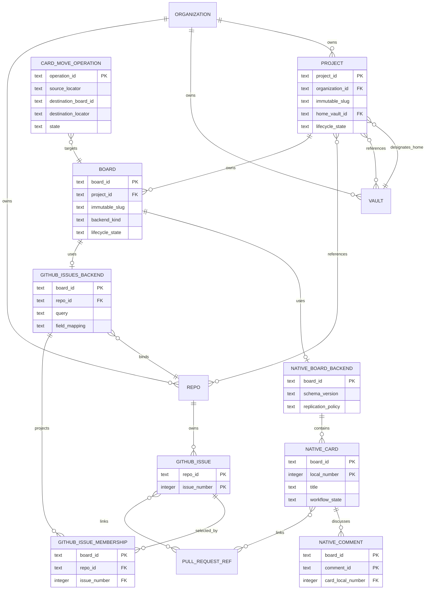

# ADR 0026 — Project Home Vaults and Provider-Backed Boards

- Status: Accepted
- Date: 2026-07-17
- Supersedes in part: ADR 0005's optional-vault Project definition, “project has no working files” hierarchy, and two-database authority summary
- Amends: ADR 0004's structured-vault examples and sync boundary; ADR 0009's Hall-owned card projection; ADR 0016's vault sync/backup scope
- Depends on: ADR 0010 (identity/RBAC), ADR 0024 (Auth Broker), ADR 0025 (Repo/GitHub)

## 1. Context

Projects need sovereign, recoverable project content: description, durable contexts, documentation, settings, boards, and card prose. Olympus must be able to discover project content by attaching a vault without treating portable files as authority to create identities or privileges.

Boards need both a native local-first backend and provider-backed implementations. In particular, a project board may directly present GitHub Issues while GitHub remains authoritative. Pull requests remain Repo entities under ADR 0025.

Native board data has two different writer models:

- prose benefits from visible Markdown and jj history;
- structured state needs relational queries and CRDT convergence.

Mirroring either model into the other would create two writable truths. One project-wide database would also make every board share a lock, replication stream, migration, backup, and corruption domain. Olympus chooses an independently synchronized structured store per native board and accepts the resulting lifecycle obligations.

### Current implementation, verified

The current Project filesystem mirror lives under Hall state and initializes optional `vaults`, `repos`, and `boards` lists as empty (`crates/control-plane/src/projects.rs:1-64`); there is no mandatory home Vault. Card creation uses `card-<UUID>` (`crates/control-plane/src/server/routes/cards.rs:101`) and Hall's central SQLite schema owns the canonical `cards` table (`crates/control-plane/src/log.rs:1093`). The current Vault creation request still requires a backend and passes it directly into creation (`crates/control-plane/src/server/routes/vaults.rs:40-75`), contrary to accepted ADR 0016. There is no board-local database, description lifecycle, move saga, provider-backed Board contract, or safe Project scan/import path. Section 15 makes these migrations prerequisites and forbids a dual-write compatibility architecture.

## 2. Decision

Every Project belongs to one Organization and designates exactly one same-organization **home vault**. The project may reference additional vaults and repositories. The home-vault edge is a required content-location reference, not ownership of the Vault.

A Project owns one or more durable Board resources. Each Board selects exactly one immutable backend kind:

- `native`: structured state in one board-local cr-sqlite database; prose in Markdown;
- `github_issues`: GitHub Issues and comments in one referenced Repo are authoritative.

**Doctrine:** Hall owns registration, authorization, allocations, and distributed operations; the home vault owns project prose; each native board database owns admitted structured board state; an external provider owns provider-backed state; Hall's cross-board views are rebuildable projections.

No field has two canonical writable owners.

## 3. Domain model



Card identity is a tagged locator:

```text
NativeCardLocator { project_id, board_id, local_number }
GitHubIssueLocator { repo_id, issue_number }
```

Only native Cards receive Hall numbers and human keys such as `<BOARD_SLUG>-<NUMBER>`. A GitHub issue is canonically located by Hall's immutable `repo_id` plus issue number. Provider repository ID is resolved only through that Repo's current immutable binding and is not caller-supplied locator authority; admission, lookup, authorization, dispatch, durable operations, and restore reject a missing, retired, stale, or mismatched binding before provider access. `owner/name#number` is display/routing metadata, not a second identity. Every Card/Thread API returns `backend_kind`, the tagged canonical locator, and an optional display key. Durable links and sagas store tagged locators, never an ambiguous string. Tests cover forged provider-ID hints, rename/transfer, retired Repo, and stale binding.

A `github_issues` Board stores a rebuildable membership projection from its provider query. An issue entering or leaving that filter changes Board membership only; it does not create, delete, or change the issue's canonical identity.

## 4. Authority matrix

| Concern | Canonical authority | Derived/portable form | Forbidden inference |
|---|---|---|---|
| Project/Board registration, org, grants, tombstones | Hall security/domain stores | sanitized manifests | filesystem presence cannot create or resurrect an entity |
| Home-vault and Repo references | Hall Project revision | manifest declarations | manifest edits cannot grant access or bind credentials |
| Project contexts/docs | Markdown bytes and jj history in home vault | search/index cache | Hall projection cannot overwrite prose |
| Native structured board/card fields | board's cr-sqlite tables after Hall admission | deterministic export and Hall index | Markdown/frontmatter cannot override them |
| Native card description | `cards/<card-key>.md` and jj | search/index cache | database cannot silently overwrite prose |
| Native card comments | board cr-sqlite comment tables, Markdown bodies | Hall thread projection/export | filesystem files do not mint comments |
| GitHub-backed cards/descriptions/comments | GitHub Issues API | bounded Hall cache/export | local cache or Markdown cannot write provider truth |
| Native card numbers and all move sagas | Hall durable allocation/operation records | admitted participant markers | `MAX()+1`, filename, or CRDT merge cannot allocate identity |
| PRs/reviews/checks | Repo/provider under ADR 0025 | Hall projection | Board does not own PR lifecycle |
| Physical files/DB health | Envoy observation | Hall health status | presence does not imply authorization |
| Editable Markdown replication | jj through approved vault adapters | binding status | cr-sqlite does not transport Markdown |
| Editable native structured replication | logical cr-sqlite protocol | peer status/cursors | jj or file copy does not replicate live DBs |
| Backups | immutable snapshot service | encrypted manifest/object set | backup objects do not become live replicas implicitly |

## 5. Project home vault

Project creation requires `home_vault_id`. The default UX creates a dedicated Vault, while advanced users may select an existing same-organization Vault they are authorized to use. Creation validates path availability and writes Hall registration before materialization; failures are reconciled through a durable creation operation.

A Vault may host multiple Projects under separate roots. A Project may reference multiple additional Vaults, but has exactly one home Vault at a time. Project access and home-vault access are independently checked; access to the Project does not broaden Vault grants.

Deleting/retiring a Project removes Hall references and disables new operations. It never implicitly deletes the Vault or project bytes. Deleting/retiring a Vault is denied while it is a Project home unless each Project is explicitly retired or rehomed.

Rehoming is a durable, audited saga that:

1. validates same-org target and grants;
2. freezes project content mutations or establishes an explicit revision/vector barrier;
3. copies/verifies Markdown, descriptors, native board snapshots, and attachment references;
4. switches `home_vault_id` in Hall;
5. leaves a non-authoritative relocation marker at the source;
6. resumes writes only after verification.

If the home Vault is unavailable, Hall retains Project identity and metadata, shows the Project degraded/read-only where required, and does not synthesize missing content from caches.

### Mandatory-home-Vault cutover

This is a one-time hard migration, not a nullable compatibility mode:

1. First fix Vault creation so an Olympus-only Vault is the default and no GitHub backend is required.
2. Freeze Project creation/content mutation and inventory every live/tombstoned Project, manifest, legacy content root, Board/Card reference, and hash.
3. For each live Project, require an explicitly authorized same-org target Vault or create a dedicated Vault through a resumable `ProjectHomeMigration` operation. Copy content, rewrite portable descriptors deterministically, and record source revision/hash and target provenance.
4. Verify Project/Board/Card counts, bytes, hashes, references, and tombstones. Crash/restart tests cover Vault creation, Hall relation write, content copy, verification, cutover, and retirement.
5. Only after every live Project is verified, atomically deploy the event/schema and API cutover in which `home_vault_id` is required/non-null and old create/update shapes are rejected.
6. Delete the legacy Project-content mutation and fallback-read paths. Retain only an immutable migration report; the legacy directory is not a runtime content authority.

Migration cannot partially enable the new model. A failed Project remains in the pre-cutover frozen fleet and blocks global cutover rather than introducing a null home Vault.

## 6. Canonical project layout

```text
<home-vault>/
└── projects/
    └── <project_slug>/
        ├── project.json
        ├── README.md
        ├── context/
        │   ├── conventions.md
        │   ├── domain-model.md
        │   └── decisions.md
        └── boards/
            └── <board_slug>/
                ├── board.json
                ├── board.db                 # native backend only; excluded from jj
                └── cards/                   # native backend only
                    └── <BOARD_SLUG>-NNNN.md
```

`project.json` and `board.json` are strict, versioned, portable descriptors. They contain immutable content identity, display metadata, backend kind, schema version, and portable resource declarations. They contain no access policy, role, credential/secret reference, executable hook, absolute host path, sync endpoint, refresh state, peer cursor, or runtime lease.

Human-facing project context is visible Markdown, not hidden under `.olympus/`. Context files are deliberately promoted project knowledge—conventions, domain model, settled decisions, operating notes—not automatic transcript dumps.

For a native board, `board.db`, `board.db-wal`, and `board.db-shm` are normatively excluded from jj and every file-copy sync adapter. `board.db` remains at the user-visible requested path but is a live structured artifact. Only the logical CRDT replication protocol transports editable structured state. A deterministic portable export or coherent closed snapshot is used for transfer and recovery.

Symlinks are rejected for manifests, board databases, card descriptions, and scan traversal. All paths are canonicalized beneath the selected home-vault/project root before use.

## 7. Native board storage

Each native Board has one independent SQLite database extended with Superfly's maintained `cr-sqlite` fork. Olympus must pin an immutable reviewed source commit and verified artifacts/checksums in the dependency/build lock; it does not track an unpinned branch or the stale original `vlcn-io` repository. The implementation must pass the substrate gate below before the first production board.

One database per Board is intentional:

- SQLite writer locking is isolated per Board;
- Boards can be subscribed, restored, and transferred independently;
- corruption and schema-migration blast radius is bounded;
- Board ownership and provider abstraction stay explicit.

The operational cost is also explicit: every Board is its own connection, extension initialization, CRDT site, schema migration, replication cursor, WAL/checkpoint, health, backup, and restore domain. Envoy owns this lifecycle and opens databases lazily with bounded pools. Hall projections provide cross-board listing, search, and reporting; Olympus does not open every Board DB or add a second writable aggregation database for global queries.

Structured card fields include title, workflow state/column, assignee references, labels, priority, due date, position, lineage, and admitted operation markers. Card descriptions exist only in Markdown. Structured fields are not mirrored into Markdown/frontmatter.

cr-sqlite is a convergence substrate, not a complete replication service. Olympus owns:

- authenticated peer admission and per-Board authorization;
- site identity and schema-version negotiation;
- gap detection, per-site sequence tracking, and peer progress;
- partial-transaction buffering and explicit transaction-completeness metadata;
- duplicate/out-of-order delivery and retry idempotency;
- tombstone retention, acknowledgement, compaction, and restored-peer behavior;
- invariant reconciliation where per-column convergence can produce an invalid workflow combination;
- transport backpressure, health, observability, and repair.

Each Board keeps a durable outgoing version journal alongside CRDT metadata. Before a local commit can be acknowledged as replicable, a transaction-bound hook records site ID, `db_version`, expected sequence range/count and digest (or an equivalently complete manifest), schema version, and pinned extension build. This evidence must become durable with the Board write before later writes can supersede history; the substrate spike must prove the exact extension hook/transaction boundary, and failure to do so rejects the substrate rather than weakening the invariant.

Receivers acknowledge complete version manifests, never inferred continuity of surviving `crsql_changes` rows. The journal distinguishes complete-but-superseded versions from transport gaps and partial transactions. Retention/compaction waits for every admitted peer acknowledgement or an explicit audited peer eviction. A peer behind retained history receives a coherent snapshot and new cursor barrier. Handshake and snapshot manifests carry schema and extension versions; incompatible writers are rejected before changes apply.

## 8. Native card descriptions and communication

The database row is authoritative for native Card existence. A missing Markdown file means an empty or temporarily unavailable description and is recoverable; it does not delete the Card. An orphan description is quarantined and offered for recovery; it does not mint a Card.

Creating a native Card is a durable operation across Hall allocation, Board DB, Markdown, and jj. Conceptual states are:

```text
allocated -> db_created -> description_created -> committed
                         \-> reconcile/retry
```

Every participant records the operation ID. Partial states are visible as degraded, not falsely complete, and retries are idempotent.

Native comments are structured communication records in the Board DB with Markdown bodies:

```text
card_comments(
  site_id, site_counter, client_operation_id, card_local_number,
  author_principal_ref, body_markdown,
  order_hlc, created_at, edited_at, deleted_at,
  reply_to_site_id, reply_to_site_counter
)
```

Native `CommentLocator { board_id, site_id, site_counter }` is collision-free without Hall coordination: each admitted replica durably increments its own counter under its immutable CRDT site identity. A unique `client_operation_id` makes retries create one comment. Deterministic thread order is `(order_hlc, site_id, site_counter)` rather than wall-clock arrival. GitHub comments use tagged `GitHubCommentLocator { repo_id, provider_comment_id }` and retain provider order.

Author principal is immutable and Hall-derived at admission. Offline comment creation requires an unexpired Hall-signed capability lease bound to user, Board, replica site, and actions; without one, the UI may retain a local draft but may not admit/replicate a comment. Reply targets must exist or have a retained tombstone. Edit/delete checks the original author or a stronger moderation capability; deletion retains a tombstone until every admitted peer acknowledgement or eviction. Reply edges survive parent deletion/restore, and attachment reachability follows retained comments/tombstones. Acceptance tests cover simultaneous two-site create, duplicate replay, skewed clocks, edit/delete races, reply-to-deleted, forged author, expired offline lease, restore, and compaction.

Comments are not individual files: authorship, ordering, edits, tombstones, and reply relations are structured state, while the body remains portable Markdown text. Attachment bytes live in Vault content-addressed storage and comments/cards retain stable references.

## 9. Native card identity

Hall durably allocates monotonically increasing, never-reused numbers per Board inside one serialized allocation write boundary. Allocation must not derive from a stale projection or `MAX()+1`. ADR 0020 identifies the current append-then-apply seam as non-serialized; that seam must be replaced or a dedicated transactional allocation table added before this invariant can be claimed in code.

The canonical human key is:

```text
<immutable-board-slug>-<sequential-number>
```

Examples: `DEV-0001`, `DEV-0042`, `DEV-10000`. Four digits are minimum display padding, not a maximum. APIs may accept case-insensitive/unpadded input such as `dev-42`, but return canonical `DEV-0042`. Mutation lookup is exact after normalization; fuzzy matches may be suggested but never mutated automatically.

Board slug is immutable after first card allocation; a separate display name may change. New durable Card creation requires Hall connectivity. Existing admitted Card edits may remain local/offline subject to Board CRDT policy. Olympus deliberately rejects offline central-number guessing and leased ranges until a demonstrated use case justifies their complexity.

## 10. GitHub Issues board backend

A `github_issues` Board references exactly one Repo already referenced by the Project and records a versioned issue query/filter plus explicit field mappings. It stores no GitHub credential. ADR 0024/0025 resolve authorization and actor identity.

Olympus normalizes the provider into Board/Card/Thread APIs, but GitHub remains canonical:

| Olympus surface | GitHub authority |
|---|---|
| Card locator | `GitHubIssueLocator { repo_id, issue_number }`; provider repository ID derives from the Repo binding, `owner/repository#number` is the display key, and `#number` may be shown in a single-repo Board |
| Title and description | issue title and body |
| Communication | issue comments |
| Open/closed state | issue state |
| Assignee, labels, milestone | corresponding issue fields |
| Activity | issue timeline/events |

No editable `cards/*.md` or native `board.db` mirror is created for a GitHub-backed Board. Hall may retain a bounded derived projection for search, offline reads, and cross-board views.

Arbitrary Kanban columns require explicit mapping. An initial label mapping may define status labels and closed-state behavior. No configured status label maps to `Unclassified`; multiple configured status labels map to `Mapping conflict`. Olympus never silently chooses one and mutates the issue. A future GitHub Projects v2 integration is a distinct backend because its permissions, fields, and semantics differ.

Board capabilities are advertised by the backend—create, edit description, comments, custom columns, assignees, milestones, attachments, offline write, and move. Unsupported controls remain visible but disabled with an explanation.

## 11. Pull requests and card links

Pull requests are Repo entities under ADR 0025, never Board cards merely because they appear in the same UI. Native or GitHub-backed Cards may link to zero or more PRs using full repository-qualified references. Links can be explicit or provider-derived.

PR changes do not implicitly mutate Card state. Project workflow rules may opt into audited transitions with provider revision preconditions and conflict handling.

## 12. Cross-board copy/move saga

A Card move never mutates identity. It creates a destination Card with a new destination identity and preserves the source. Hall records cross-backend lineage under `CardMoveOperation`/relationship authority:

```text
source_locator -> destination_locator, operation_id, captured_revision
```

Native participants may additionally persist admitted operation markers for local recovery. A GitHub issue never acquires an Olympus-native `moved` field; optional close, comment, or cross-link is a separate explicit provider operation.

Descriptions are copied at one captured revision and then diverge independently. The destination maps its column explicitly. Current title, labels, priority, assignee, due date, and relevant metadata are copied; attachments remain content references rather than duplicated bytes. Source history remains addressable.

Because Boards and providers cannot share one transaction, Hall owns a durable `CardMoveOperation`:

```text
requested -> destination_allocated -> destination_created
          -> source_marked -> completed
```

The record includes operation/idempotency ID, immutable source revision/locator, destination Board, reserved destination locator, participant status, lease/epoch, retry state, and errors. Only one active move per source revision is admitted. The source is not marked moved until destination structured state and description/provider body exist. Every retry discovers the same destination.

Backend combinations use the same saga:

- native → native: create DB row and Markdown copy;
- native → GitHub: create an issue, then mark native source moved;
- GitHub → native: create native Card from a captured issue revision; closing/linking source is explicit;
- GitHub → GitHub: create destination issue and explicit lineage because GitHub does not move issues across repositories.

Provider writes use ADR 0025 durable operations. Closing a source issue is an explicit move option, never an assumption.

## 13. Discovery, import, and re-registration

Scanning an attached Vault produces **untrusted discovery candidates**, not Hall entities. Content write access is not registration or privilege authority.

Import/re-registration requires explicit capabilities rather than mere authentication. `project.import` creates a new Project candidate; `project.restore` targets a retired/tombstoned Project and is stronger; `board.import` imports a Board; `resource_reference.bind` binds existing Vault/Repo resources. Destructive replacement/tombstone resurrection requires a separate restore capability naming the exact target.

No ordinary role—including member, content writer, Project member, or dynamically named administrator—implicitly grants these capabilities. A current organization owner may issue/revoke an explicit capability delegation: `project.import` is scoped to an organization; `board.import` to an organization/Project; `resource_reference.bind` to the exact target organization and resource kind/identity constraints; `project.restore` and destructive resurrection are single-target, single-use grants requiring a separate approval after preview. Self-delegation is forbidden in the same transaction; an owner's self-directed operation requires approval by another current owner or audited installation-token break-glass. Exercise always requires the explicit unexpired delegation, not merely the delegator's role. Installation-token use is a distinct audited break-glass actor mode and is never silently equivalent to org administration.

The importing principal must simultaneously hold candidate-Vault read permission, target Project/Board create-or-restore permission, and current access to every referenced Vault/Repo. Hall recomputes this intersection and authorization epoch at commit. Import/re-registration then requires:

1. strict versioned schemas and rejection of unknown security-relevant fields;
2. immutable manifest project/Board identities plus organization selection;
3. symlink-safe canonical paths beneath bounded roots;
4. bounded file size, depth, Board/Card count, and total bytes;
5. tombstone and collision checks;
6. capability intersection for every referenced Vault/Repo;
7. no imported credentials, grants, policies, hooks, local paths, or implicit network actions;
8. preview/diff producing a digest over the exact candidate schema version, Vault/jj revision, files, proposed bindings, and target identity;
9. provenance: Vault ID, jj revision, manifest hash, importer, and time;
10. idempotency by organization, manifest identity, and revision/hash;
11. compare-and-swap commit of that exact preview digest and authorization epoch; changed content/bindings or revoked access invalidates approval.

Portable content and descriptors may be restored verbatim. Access policy is reconstructed from current Hall policy, not imported. Repo and additional-Vault references are unresolved proposals until a principal holding `resource_reference.bind` for the exact current resource and target organization binds them. Cryptographic signatures improve provenance but never replace authorization. Authorization tests cover ordinary member, content writer, Project member, delegated importer, restore administrator, stale delegation epoch, owner self-delegation, and installation-token break-glass.

A vault tree without native Board structured snapshots cannot recreate structured Card state; it can recreate the Project/Board candidates and prose only. Complete sovereign recovery therefore requires the snapshot/export contract below as well as jj content.

## 14. Synchronization, backup, and restore

Editable synchronization is split by data shape:

- Markdown/descriptors: jj through ADR 0016-approved adapters;
- native structured state: authenticated logical cr-sqlite change exchange;
- GitHub-backed state: GitHub API/webhooks/reconciliation;
- cross-board views: rebuildable Hall projections.

Blind copying of live `board.db`, `-wal`, or `-shm` is forbidden. Native Board backup produces two artifacts:

1. **Operational replica snapshot:** SQLite Online Backup API or `VACUUM INTO` from a connection with the exact extension loaded, preserving extension metadata; verified by `PRAGMA integrity_check`, application invariants, and restore/resync tests.
2. **Sovereign portable export:** documented deterministic schema/data bundle or coherent closed SQLite snapshot. Import validates IDs/references and creates a deliberate new site unless performing an authorized replacement restore.

A replacement restore and a fork restore are different operations. They explicitly handle CRDT site identity, peer cursors, stale replicas, tombstones, and original-site fencing.

A Project backup is a manifest of one jj revision, per-Board snapshot/version vectors and timestamps, attachment hashes, and any in-flight Hall saga records. It does not claim a global instant unless writes were fenced across all participants. Restore surfaces mismatched points and reconciles incomplete creation/move operations before accepting writes.

Restored external-effect saga records are recovery evidence, never automatic retry authority. They enter `recovery_required`. Replacement restore first fences the original Hall/Envoy, operation namespace, and CRDT sites; fork restore mints new operation/site namespaces. Before retry, Olympus discovers current provider truth using immutable result ID, stable operation marker, target precondition, and current provider state. A found result is attached; ambiguity stops for reconciliation. Current membership/RBAC/capabilities/grants and the original actor connection are re-evaluated, and actor mode never falls back from user to App. Restore tests cover every move/provider-write crash point, including provider commit plus lost response followed by restore.

## 15. Implementation prerequisites and migration debt

Before native Boards ship:

1. supersede the current central Hall-card write model while retaining only allocation, registration, saga/audit, and rebuildable cross-board projections;
2. complete the mandatory-home-Vault migration and hard API/event/schema cutover above; no nullable field, old-root fallback, or dual content writer is permitted;
3. implement the serialized durable card-number allocator and prove no reuse across delete/restore;
4. run a disposable cr-sqlite substrate gate covering extension packaging/loading on every connection, WAL, schema migration, two-peer convergence, duplicates, gaps, out-of-order and partial transactions, delete/update races, compaction, backup/restore/resync, and extension upgrade; specifically prove all rows of an old version may be superseded before a peer asks, crash between DB commit and manifest durability is fail-closed/recoverable, reconnect behind compaction uses a snapshot barrier, and replacement restore fences the original site;
5. implement Board lifecycle, bounded connection pools, replication protocol, admission, invariant repair, health, and snapshots;
6. implement durable creation and move operations with crash-point tests at every transition;
7. implement strict manifests, scan limits, import preview, provenance, collision/tombstone checks, and no-privilege-import tests;
8. migrate existing Hall cards through a deterministic one-time exporter/importer, verify counts/content/lineage, then delete superseded central mutation paths rather than maintaining dual write;
9. correct the current Vault API drift that requires a GitHub backend before starting the home-Vault migration.

Before GitHub-backed Boards ship, ADR 0024 and ADR 0025 implementation gates must pass, including user/App attribution and webhook reconciliation.

## 16. Consequences

- Users retain inspectable Markdown and SQLite/open exports rather than depending on an opaque Olympus-only database.
- A Vault scan can recover content safely without turning synced files into authority over privileges.
- Native Boards are independent sync/failure domains, at the cost of explicit lifecycle, projection, saga, and backup machinery.
- GitHub Issues can be used directly without a conflicting native mirror.
- Pull requests remain correctly scoped to Repos while Projects aggregate planning context.
- Hall remains required for new Card identity and distributed operations; existing native Board edits can continue under local-first policy.
- Complete recovery requires both jj content and structured snapshots/exports.

## 17. Rejected alternatives

- **All project data only in Hall SQLite:** weakens user-held content recovery and makes Hall an unnecessary prose authority.
- **Everything in Markdown:** poor transactional/query behavior for structured Board state and comments.
- **Mirror DB fields into Markdown:** creates two writable truths and ambiguous write-back.
- **One database for all Project Boards:** simpler queries but shared locks, replication, migration, backup, and corruption domain.
- **Synchronize SQLite files through jj/Git:** unsafe with live WAL state and ignores CRDT semantics.
- **Automatically register projects found during scan:** converts content write access into control-plane and privilege authority.
- **Use UUIDs as public Card keys:** less reliable for human and LLM references than Board-local sequential keys.
- **Guess IDs offline:** collides under multi-writer creation.
- **Treat GitHub Issues as a two-way mirror of native Cards:** creates dual authority and permanent conflict policy.
- **Treat PRs as Project-owned cards:** assigns repository development state to the wrong aggregate.

## 18. External references reviewed

- Superfly, [`cr-sqlite`](https://github.com/superfly/cr-sqlite), maintained fork reviewed at `ec0d669daa9a051d4c6f4a4d9c653eac40e7a437`; implementation must pin its own reviewed immutable artifact as required in section 7.
- Superfly, [`corrosion`](https://github.com/superfly/corrosion), production reference for the replication machinery surrounding cr-sqlite, reviewed at `b1061feb1a9ab1d5d743fa0fcf790c7857c2d36e`.
- SQLite, [Online Backup API](https://www.sqlite.org/backup.html) and [`VACUUM INTO`](https://www.sqlite.org/lang_vacuum.html#vacuuminto).
