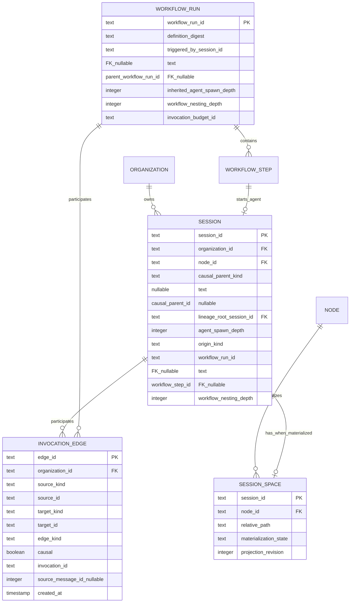

# ADR 0027 — Flat Session Spaces and Typed Invocation Graphs

- Status: Accepted
- Date: 2026-07-19
- Supersedes in part: ADR 0005 §3 `Session`, §4 filesystem tree, and §4.2 session-space nesting
- Amends: ADR 0006 session-tree materialization; ADR 0013 workflow/session boundary
- Relates to: ADR 0002 §6 session lineage, ADR 0008 Hall/Envoy ownership, ADR 0010 authorization, ADR 0017 remote execution

## 1. Context

ADR 0005 stores a main session at `~/.olympus/<org>/sessions/<id>/` but nests each sub-session inside its parent. That makes filesystem ancestry carry control-plane meaning:

```text
sessions/<main>/sessions/<sub1>/sessions/<sub2>/sessions/<sub3>/...
```

This is the wrong ownership boundary and has finite failure modes. On common Linux filesystems a single pathname component is limited to 255 bytes and the complete pathname is limited to 4095 usable bytes (`PATH_MAX` commonly includes one terminating NUL byte). IDs, organization roots, repositories, generated metadata, and tool-created paths all consume that budget. Other supported or future hosts have different limits and path semantics.

More importantly, directory nesting makes lineage node-local filesystem state even though Hall's event log is already authoritative for session relationships. It couples child lifecycle to parent retention, complicates relocation and cross-node execution, makes cleanup recursively destructive, and makes workflow-started agents difficult to represent without pretending they are subagents.

The implementation already resolves every session space directly as `<olympus_home>/<organization_id>/sessions/<session_id>` in `BridgeManager::space_path` (`crates/control-plane/src/server/bridge_mgr.rs:97-102`). `SessionForked` and `SessionView.parent_session_id` already represent lineage in Hall (`crates/control-plane/src/event.rs:115-137`, `crates/control-plane/src/views/session.rs:236-258`). The accepted filesystem ADR contradicts both the correct authority boundary and the current path implementation. The current implementation does not yet enforce a spawn-depth limit and overloads `SessionForked { fork_type: "sub" }` for agent delegation.

A second ambiguity is semantic. An agent calling a subagent tool and an agent triggering a declared workflow are different operations:

- a **subagent call** is open-ended conversational delegation from one agent session to another;
- a **workflow trigger** starts a bounded, versioned graph under ADR 0013, such as adversarial review, code review, QA, or a pull-request workflow.

Treating both as the same parent/child primitive either lets workflows accidentally consume subagent depth or lets agents evade a depth limit by relabeling delegation as workflow execution.

## 2. Decision

All physical session spaces are flat within their organization on the node that executes them:

```text
~/.olympus/<org>/sessions/<session_id>/
```

No session space is nested inside another session space. Filesystem location never encodes lineage, ownership, authorization, depth, or workflow membership.

Hall owns a typed invocation graph over sessions and workflow runs. Envoy materializes each assigned session independently and writes rebuildable context projections into its flat session space. The graph and event log are canonical; files and optional symlinks are never authority.

Agent delegation is capped at three spawn edges: main session depth 0, subagent depths 1, 2, and 3. A depth-3 agent cannot call the subagent tool. Workflow triggers are separately authorized graph invocations: they do not increment agent-spawn depth, but they also never reset it.

**Doctrine:** session storage is flat; agent delegation and workflow execution are distinct typed graphs; Hall enforces graph invariants before Envoy performs any host effect.

## 3. Domain model



### 3.1 Invocation edge kinds

`edge_kind` is a closed, versioned enum rather than a free-form string:

| Kind | Source → target | Causal | `agent_spawn_depth` effect |
|---|---|---:|---:|
| `agent_spawn` | Session → Session | yes | target = source + 1 |
| `workflow_trigger` | Session/service principal → WorkflowRun | yes | run inherits source depth |
| `workflow_agent` | WorkflowRun → Session | yes | session inherits run depth |
| `session_fork` | Session → Session | yes | target preserves source depth |
| `session_handover` | Session → Session | yes | target preserves source depth |
| `context_reference` | execution node → execution node | no | none |
| `completion_to` | execution node → delivery target | no | none |

Every Session or WorkflowRun has zero or one immutable causal parent. It may have multiple noncausal references. Causal edges form a DAG and participate in authority, depth, budget, cancellation, retention, and audit. Noncausal edges never do. A workflow agent's causal provenance is its `(workflow_run_id, workflow_step_id)`, not a fabricated parent session.

`SessionForked { fork_type: "sub" }` is transitional. Migration introduces an explicit typed invocation event; historical `sub` events project as `agent_spawn` only where the event represents actual tool delegation. Ambiguous historical records remain `session_fork` and do not acquire invented depth.

## 4. Flat filesystem layout

```text
~/.olympus/<org>/sessions/
├── <session-a>/
│   ├── .olympus/
│   │   ├── session.json
│   │   ├── lineage.json
│   │   └── CONTEXT.md
│   └── repos/...
├── <session-b>/
└── <session-c>/
```

Rules:

1. The portable locator is `(organization_id, session_id)`, not an absolute path. `node_id` identifies the Envoy that currently materializes the bytes.
2. Envoy derives the path from validated identifiers. User-controlled titles, prompts, workflow names, and agent names never enter path components.
3. A session ID is an opaque bounded identifier and must pass component-safety validation before any host effect.
4. Archiving or deleting one session never recursively archives or deletes related sessions. Hall emits explicit lifecycle operations for every affected session.
5. Relocation or rematerialization creates the same flat relative path on the destination node. Lineage needs no rewrite.
6. Symlinks are optional operator ergonomics only. They are absent in v1 unless a demonstrated need justifies them. If later enabled, they live under reserved `.olympus/links/`, never overwrite user content, are relative, same-organization, cycle-safe, rebuildable, and ignored by authorization, retention, and recovery.
7. Correctness paths enumerate sessions through Hall or Envoy's reconciliation index, never by scanning `sessions/`. The flat physical shape is an internal implementation choice rather than a public identity contract.

## 5. Agent-spawn depth and creation invariants

Depth uses edges, not levels:

| Session | `agent_spawn_depth` |
|---|---:|
| Main or independent root | 0 |
| Subagent 1 | 1 |
| Subagent 2 | 2 |
| Subagent 3 | 3 |

Hall rejects an `agent_spawn` when the parent's projected depth is 3. Creation is one serialized operation that validates and durably records the child session, organization, capability envelope, relation, derived root/depth, and materialization intent before Envoy creates files or starts a process.

The single-writer transition must enforce all of these invariants atomically:

- parent and child exist in the same organization;
- parent is authorized for `session.spawn` and the requested child capability envelope cannot exceed the effective parent authority;
- parent depth is less than 3;
- child ID is new and has no existing causal parent;
- child depth equals `parent.agent_spawn_depth + 1`;
- child `lineage_root_session_id` equals the parent's root;
- source and target differ, the target has no causal parent, and adding the edge cannot create a cycle;
- retrying the same `invocation_id` returns the original child instead of creating another;
- the causal root's shared budget and concurrency are reserved before materialization;
- failure before the durable transition creates no directory; failure after it is reconciled from durable desired state.

Depth is a Hall policy field derived from accepted typed events. Envoy metadata and `lineage.json` cannot grant permission or lower depth. Missing, corrupt, cross-organization, cyclic, or ambiguous ancestry fails closed for new agent spawning.

Imported sessions may contain deeper or incomplete historical ancestry. Olympus preserves and displays that history but does not permit a session at derived depth 3 or greater to create another `agent_spawn`.

Effective child authority is the intersection of the authenticated initiator, causal parent session/run, requested child envelope, organization/project policy, and runtime/provider grants. Effective workflow authority is the caller intersected with the pinned workflow manifest, organization/project policy, and provider grants. Scheduled workflows use dedicated revocable service principals; publishing or editing a workflow never lends the editor's authority to later runs. Ownership, revocation, typed scope, and runtime attempt are rechecked at spawn, workflow start, step dispatch, resume, completion delivery, context traversal, and context refresh.

## 6. Workflow triggers are not subagent calls

A workflow trigger starts a `WorkflowRun` governed by ADR 0013. It requires a distinct capability such as `workflow.run:<definition>`; `session.spawn` does not imply it, and workflow authority does not imply open-ended subagent authority.

A workflow definition remains a finite, immutable DAG:

- definitions cannot contain loops, recursion, dynamic sub-DAG generation, or a generic `run_workflow` activity;
- every agent-starting step is declared in the pinned workflow definition;
- the run records the triggering session, definition digest, step, attempt, idempotency key, budget, and effective capability envelope;
- a workflow run inherits the triggering session's `agent_spawn_depth`, and a `workflow_agent` session preserves that inherited depth; it never resets the counter. Any subagent tool call then applies the ordinary `+1` rule. A scheduled workflow without an initiating session begins under its dedicated service principal at depth 0;
- workflow-started sessions remain associated with their run and step even after the triggering session is archived;
- workflow agents receive an explicit least-privilege capability envelope bounded by the workflow definition, caller authority, organization policy, and run budget. They do not inherit unrestricted operator authority.

Workflow runs do not provide a depth-label escape hatch. An agent may trigger a workflow only through Hall's workflow API/tool after authorization and budget reservation; an activity provider cannot start one out of band, and a caller cannot create a session and relabel its edge `workflow_agent`.

Hall tracks `workflow_nesting_depth` across the full causal ancestry, including workflow runs separated by workflow-created agents. A root invocation has depth 0; a descendant starting another workflow increments it. V1 rejects a workflow definition digest already present in the active workflow ancestry and rejects a resulting workflow nesting depth above 8. Retry or recovery of the same `workflow_run_id` reuses the existing ancestry, depth, and budget reservation. These controls preserve ADR 0013's non-recursive scope ceiling while allowing finite compositions of distinct workflows.

Every causal execution root owns one durable budget account shared by all descendant sessions, workflow runs, steps, retries, jobs, and workflow-created agents. It limits at minimum active/total agents and runs, workflow steps/retries, model/provider spend, CPU and memory time, wall-clock lifetime, output/artifact/context bytes, and concurrent fan-out. A child may receive a narrower sub-budget but cannot mint capacity or reset accounting at a workflow boundary.

## 7. Context projection

Hall's graph is canonical. Envoy generates two rebuildable projections in every materialized session space:

- `.olympus/lineage.json`: versioned machine-readable graph snapshot;
- `.olympus/CONTEXT.md`: concise agent/operator orientation generated from the same snapshot. Runtime adapters explicitly surface this managed file to agents; Olympus does not claim a user-owned root filename.

The projection includes:

- schema version, session ID, organization, graph revision/event watermark, generation time, and staleness marker;
- root objective or summary reference;
- typed causal ancestors, `agent_spawn_depth`, and `workflow_nesting_depth`;
- direct children and all transitive `agent_spawn` descendants;
- associated workflow runs and workflow-started agent sessions;
- status, short summary, artifact references, and workspace locator for each visible related session;
- tombstone/unavailable markers where a related workspace or summary has been retained only as metadata.

It does **not** inline every transcript. Full history is fetched on demand through Hall's authorized session APIs. Projection generation has deterministic ordering, visited-node deduplication, configurable node and byte limits, and explicit truncation markers. Noncausal reference cycles are never traversed transitively. This prevents quadratic file growth and unbounded model-context ingestion as a graph expands.

Envoy writes projections through temporary sibling files, flushes them, atomically renames them, and fsyncs the parent directory where the host supports it. Concurrent graph changes produce a later replacement; agents may observe an older complete snapshot but never a partially written one. Reconciliation lazily rewrites stale projections at create/resume or before context use rather than eagerly rewriting every descendant. Projection generation filters every node and artifact through the requesting session's organization and capability envelope; a graph edge is not itself permission to read another transcript, workspace, secret, or artifact.

`.olympus/CONTEXT.md` is generated explanatory input, not an instruction authority. It clearly delimits summaries as potentially untrusted agent output and never copies secrets or raw tool output by default.

## 8. Lineage, retention, and failure semantics

- Hall retains causal events, tombstones, ownership, pinned workflow/provider digests, authority decisions, and budget charges after session-space garbage collection while any retained descendant or nonterminal run refers to them.
- A missing node or deleted workspace makes the session `unmaterialized` or `unavailable`; it does not remove graph edges.
- Descendant enumeration is graph traversal over Hall projections, never a directory walk.
- Card ownership and authorization propagation traverse typed causal ancestry, not noncausal `context_reference` or `completion_to` edges.
- Capability revocation is evaluated dynamically at the next operation as required by ADR 0013. Cached context files do not preserve revoked access.
- No graph invariant assumes relatives are colocated. Scheduling policy may prefer colocation, but context and artifacts cross nodes through authorized Hall/Envoy protocols, not filesystem-relative traversal.
- Every workspace materialization and runtime has a Hall-issued attempt epoch. Exactly one Envoy reconciles `(session_id, materialization_epoch)`; relocation, recovery, cancellation, archive, or tombstone fences stale Envoys and runtimes from writing files, publishing context, completing, or performing effects.

## 9. Migration

1. Introduce typed invocation events/projections and explicit causal parent, `agent_spawn_depth`, `lineage_root_session_id`, `workflow_nesting_depth`, workflow provenance, shared budget account, materialization epoch, and idempotent invocation ID.
2. Backfill existing `SessionForked` history conservatively. Preserve ambiguous links without granting spawn authority.
3. Keep `BridgeManager::space_path`'s existing flat `<org>/sessions/<session_id>` behavior and add identifier validation.
4. Detect any already-nested session spaces. For each child, stop its runtime, move or rematerialize it at the flat path, update Envoy's reconciliation locator, verify its jj workspace, and only then remove the old directory. Never follow symlinks during migration.
5. Generate `.olympus/lineage.json` and `.olympus/CONTEXT.md` from Hall and verify transitive descendants, organization filtering, atomic replacement, and stale-revision repair.
6. Replace the overloaded `fork_type: "sub"` creation route with the typed `agent_spawn` operation. Keep read compatibility until historical events have been projected.
7. Add the separate workflow-trigger operation and capability. Do not route workflow execution through the subagent endpoint.

No dual-write period treats nested and flat paths as simultaneous authority. The graph is authoritative before filesystem migration begins.

## 10. Required verification gates

Before implementation is considered complete:

- path tests prove main, child, grandchild, and depth-3 sessions are sibling directories directly beneath `<org>/sessions/`;
- depth tests prove 0→1→2→3 succeeds and a further `agent_spawn` fails without creating an event, directory, budget reservation, or process;
- idempotency tests prove retrying one invocation returns one child;
- cycle, duplicate-causal-parent, missing-parent, and cross-organization edges fail closed;
- authorization tests prove child authority cannot exceed parent authority and workflow authority is independent from `session.spawn`;
- workflow tests prove workflow agent steps preserve initiating spawn depth, scheduled roots begin at 0, definition recursion is rejected, indirect `A→agent→B→agent→A` cycles fail, and nesting depth 9 fails;
- projection tests cover all transitive descendants, capability filtering, tombstones, stale revisions, and atomic replacement;
- migration tests use copied fixture trees containing nested children, symlinks, interrupted moves, jj workspaces, and missing nodes;
- retention tests prove deleting a parent workspace cannot recursively delete child workspaces.
- concurrency tests prove duplicate invocation creates one child and one budget reservation, and stale materialization epochs cannot write or complete.

## 11. Consequences

### Positive

- Path length is bounded independently of delegation depth.
- Session spaces can be moved, retained, archived, or deleted independently.
- Hall's durable graph is the sole lineage authority, consistent with the control-plane/Envoy boundary.
- Agents can discover grandchildren and workflow participants without crawling directories.
- Subagent delegation and reusable orchestration have separate authorization, budgets, provenance, and limits.
- The existing flat `BridgeManager` path behavior becomes intentional rather than accidental ADR drift.

### Costs

- Hall needs typed invocation events and stronger graph projections instead of one overloaded parent field.
- Envoy must reconcile context projections and nested-path migration.
- Agents cannot infer lineage from `pwd`; they use generated context or Hall APIs.
- Historical `fork_type: "sub"` records require conservative classification.

## 12. Rejected alternatives

### Keep nesting because spawn depth is only four levels

Rejected. The depth cap reduces but does not remove path-budget and portability problems, and filesystem nesting still puts canonical control-plane meaning in node-local state.

### Use only parent/child symlinks

Rejected as authority. Symlinks become stale, can cycle, complicate sandbox mounts and relocation, and cannot safely carry authorization or retention semantics. Optional generated links remain possible.

### Put complete descendant transcripts in every workspace

Rejected. It creates duplicated sensitive data, quadratic growth, stale context, and unbounded prompt ingestion. Projections contain summaries and authorized references; transcripts remain on-demand.

### Increment workflow transitions as subagent calls

Rejected. A finite declared workflow and an open-ended agent tool call have different lifecycle, retry, authorization, budget, and audit semantics. Workflow transitions preserve agent depth without incrementing or resetting it.

### Exempt anything labeled “workflow” from limits

Rejected. Only Hall's separately authorized workflow-run operation can create workflow provenance. Workflow graphs remain finite and non-recursive, active workflow ancestry is cycle-checked, and all runs are budgeted.
