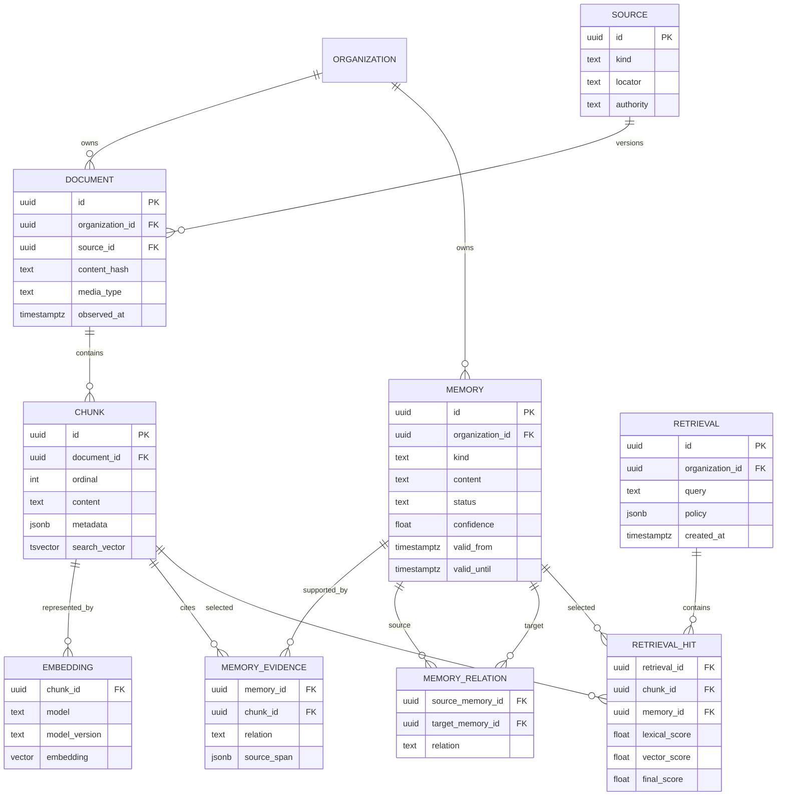

# PostgreSQL as a Future Olympus Storage and Memory Substrate

**Status:** Exploration — not an accepted architecture decision  
**Current decision:** Keep SQLite for Olympus native state until the requirements below justify a networked database.

## Motivation

Olympus currently uses SQLite effectively for a single Hall deployment, but a future Olympus-managed retrieval-augmented generation (RAG) or long-term memory system may need more than durable event storage and lexical search.

PostgreSQL could become a useful shared substrate for:

- Olympus-native events and materialized projections;
- organization-scoped documents, memories, and provenance;
- full-text and semantic retrieval;
- embedding storage through `pgvector`;
- hybrid ranking over lexical, vector, recency, and authority signals;
- background indexing and memory-consolidation jobs;
- shared state for multiple active Hall replicas;
- backups, point-in-time recovery, and hosted multi-tenant operation.

This is a stronger reason to consider PostgreSQL than data volume alone. SQLite can handle the current Olympus workload. PostgreSQL becomes compelling when Olympus needs a shared knowledge system or multiple concurrent Hall writers.

## Current state

Olympus persistence has separate ownership boundaries:

1. `~/.olympus/olympus.db` is Olympus-owned SQLite storage. It contains the native event log, durable projections, messages, and FTS5 search data. An event append and its projection update occur in one WAL transaction.
2. `~/.olympus/auth.sqlite` stores Hall authentication and organization data.
3. Hermes owns `state.db`. Hall opens it read-only and reads observed session history lazily. Olympus must not mutate it.
4. Repository workspaces, vault files, and session spaces remain filesystem resources rather than database blobs.

Moving Olympus-native state to PostgreSQL would not remove SQLite from the system while Hermes continues to own `state.db`. Remote Envoys would still need a protocol for querying or replicating their local history.

## Decision threshold

Do not migrate merely because PostgreSQL appears more “production-grade,” because `olympus.db` grows to several gigabytes, or because more messages are retained.

Adopt PostgreSQL when at least one of these becomes a concrete requirement:

1. Two or more Hall replicas must concurrently accept mutations against shared state.
2. Olympus offers a hosted, multi-tenant control plane whose state must not belong to one Hall host.
3. Olympus-managed RAG or memory needs shared vector indexes, durable indexing jobs, rich metadata filtering, and cross-node retrieval at a scale or operational model that SQLite no longer serves cleanly.
4. Recovery objectives require managed replication or point-in-time recovery.

Until then, SQLite is the simpler and more reliable default for local-first Olympus.

## Proposed role of PostgreSQL

If adopted, PostgreSQL should be treated as a coherent Olympus knowledge substrate rather than only a replacement for `olympus.db`.

```text
Hermes state.db (read-only, per Envoy)       Vaults / repositories / artifacts
                 │                                         │
                 └──────────── ingestion and provenance ───┘
                                      │
                                      ▼
                          PostgreSQL + pgvector
                    ┌────────────────────────────────┐
                    │ events and projections         │
                    │ documents and source metadata  │
                    │ chunks and embeddings          │
                    │ memories and evidence links    │
                    │ lexical + semantic indexes     │
                    │ indexing/consolidation jobs    │
                    └───────────────┬────────────────┘
                                    │
                         one or more Hall replicas
```

PostgreSQL should store metadata, normalized text, retrieval units, embeddings, and provenance. Large original artifacts should generally remain in their authoritative filesystem, repository, or object store, with stable references and content hashes in PostgreSQL.

## Memory and RAG model

A useful memory system must distinguish source material from synthesized memory. Generated memories are not facts merely because an agent wrote them.

Recommended layers:

- **Source:** a session message, vault document, repository file, user-authored note, tool result, or external artifact.
- **Document:** a versioned representation of a source with ownership, visibility, and content hash.
- **Chunk:** a retrieval unit derived from one document version.
- **Embedding:** a vector generated by a named model and model version.
- **Memory:** an Olympus-managed assertion, summary, preference, procedure, or relationship synthesized from evidence.
- **Evidence link:** the source spans supporting or contradicting a memory.
- **Retrieval record:** an audit trail showing what context was retrieved and why.

### Conceptual ERD



This is conceptual rather than a committed schema. In particular, embedding dimensions and index types must follow measured model and corpus behavior rather than being fixed prematurely.

## Retrieval design

PostgreSQL enables hybrid retrieval in one transactional system:

1. Apply organization, project, source, visibility, and time filters first.
2. Generate lexical candidates using PostgreSQL full-text search.
3. Generate semantic candidates using `pgvector`.
4. Merge and rerank candidates using explicit, inspectable signals.
5. Prefer authoritative and recent evidence where appropriate.
6. Return citations and source spans with every synthesized memory.
7. Record retrieval inputs, policy, model versions, candidate scores, and selected context for debugging.

Vector similarity alone must not decide truth. A high semantic score means “related,” not “correct.” Memory promotion, contradiction handling, expiration, and source authority need explicit policies.

## Important boundaries

### Keep the event invariant

The current invariant remains valuable:

```text
event append + durable projection update = one transaction
```

A PostgreSQL implementation must preserve it. Splitting events and projections across independently committed repository calls would weaken correctness.

### Keep Hermes ownership intact

Hermes `state.db` remains read-only. Olympus may ingest or index content through an Envoy protocol, but it must preserve source identity and must not silently turn an imported copy into the authoritative Hermes record.

### Keep files as files

PostgreSQL should not absorb git repositories, vault worktrees, session workspaces, or large artifacts. Store references, hashes, metadata, extracted text, and retrieval chunks; keep the original resource in its appropriate storage system.

### Fail closed on tenancy

Every document, memory, chunk, retrieval, and job must be scoped to an organization. If PostgreSQL is used for hosted multi-tenancy, row-level security may provide defense in depth, but application-level authorization remains mandatory.

## Costs and risks

- PostgreSQL raises the minimum deployment from local binaries and files to a managed network service with credentials, migrations, backups, and monitoring.
- `pgvector` adds extension and index lifecycle requirements.
- SQLite FTS5 behavior does not map mechanically to PostgreSQL full-text search; query parsing, stemming, snippets, and ranking must be specified and tested.
- Multiple Hall replicas also require connection ownership, bridge leases, WebSocket fan-out, duplicate-event prevention, and Envoy reconnect routing. PostgreSQL alone does not solve distributed runtime coordination.
- Supporting SQLite and PostgreSQL indefinitely creates a permanent dialect, migration, search, and testing burden.
- Embedding model upgrades require versioned vectors and controlled reindexing rather than in-place ambiguity.
- Memory synthesis can amplify errors unless provenance, contradiction, expiration, and deletion are first-class.

## Migration path

1. **Keep SQLite now.** Continue measuring database size, write latency, search latency, Hall RSS, and sync behavior.
2. **Separate storage responsibilities.** Put event transactions, projections, search, and auth behind deliberate boundaries without promising permanent dual-backend support.
3. **Adopt numbered migrations.** Replace ad hoc schema inspection with immutable, testable migrations.
4. **Prototype the memory model.** Validate chunking, hybrid retrieval, provenance, deletion, and embedding costs against a representative Olympus corpus. SQLite plus an experimental sidecar is acceptable for the prototype.
5. **Run a PostgreSQL/pgvector spike.** Compare retrieval quality and operational cost, not only benchmark throughput.
6. **Implement PostgreSQL when a decision threshold is met.** Use the same behavioral contract tests against both stores during migration.
7. **Cut over from the event log.** Stop Hall, back up SQLite, copy events in sequence, rebuild projections and indexes, verify counts and hashes, then start Hall against PostgreSQL. Preserve SQLite files for rollback.
8. **Remove the transitional backend.** Retain dual storage only if local SQLite mode and clustered PostgreSQL mode are both explicit supported products.

## Open questions

- Is Olympus memory personal, organization-wide, project-scoped, agent-scoped, or some combination?
- Which source types may be embedded, and what are their retention and deletion rules?
- Should observed Hermes messages be copied into Olympus storage or queried through Envoy on demand?
- Are memories append-only claims with supersession, or mutable rows with an audit log?
- How are contradictions represented and surfaced?
- Which embeddings run locally, and which may be sent to external providers?
- What retrieval evidence must be retained for auditability without storing sensitive prompts indefinitely?
- Is local SQLite mode a permanent product requirement after PostgreSQL exists?

## Provisional recommendation

Continue using SQLite for the present single-Hall architecture. Treat PostgreSQL as the likely substrate for a future clustered or hosted Olympus and as a serious candidate for an Olympus-managed RAG/memory system, particularly when `pgvector`, hybrid retrieval, shared indexing jobs, and organization-scoped knowledge become concrete requirements.

Before committing to migration, prototype the memory semantics and retrieval quality. The hard problem is not storing vectors; it is preserving provenance, authority, tenancy, deletion, contradiction, and debuggability.
